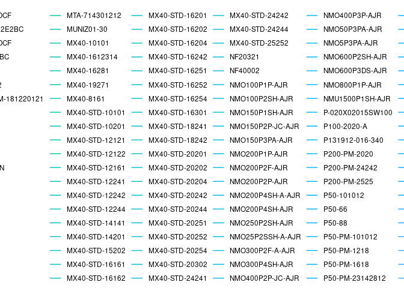
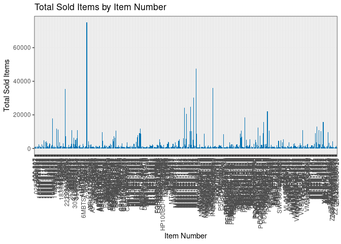

Activity 8 - Mini-competition
================

## Loading Dataset

``` r
# Load the data
data <- read.csv("inventory.csv")
```

``` r
# Load libraries
library(ggplot2)
library(dplyr)
```

    ## 
    ## Attaching package: 'dplyr'

    ## The following objects are masked from 'package:stats':
    ## 
    ##     filter, lag

    ## The following objects are masked from 'package:base':
    ## 
    ##     intersect, setdiff, setequal, union

``` r
library(forecast)
```

    ## Registered S3 method overwritten by 'quantmod':
    ##   method            from
    ##   as.zoo.data.frame zoo

``` r
# Plot the sold items by week for each item_no
ggplot(data, aes(x = week, y = sold, group = item_no, color = item_no)) + 
  geom_line() + 
  ggtitle("Sold Items by Week") +
  xlab("Week") +
  ylab("Sold Items") +
  theme_bw()
```

<!-- -->

``` r
# Plot the total sold items for each item_no
data_summary <- data %>%
  group_by(item_no) %>%
  summarize(total_sold = sum(sold))

ggplot(data_summary, aes(x = item_no, y = total_sold)) + 
  geom_bar(stat = "identity", fill = "#0072B2") +
  ggtitle("Total Sold Items by Item Number") +
  xlab("Item Number") +
  ylab("Total Sold Items") +
  theme_bw() +
  theme(axis.text.x = element_text(angle = 90, hjust = 1, vjust = 0.5))
```

<!-- -->

The first visualization shows the sold items by week for each item
number, and the second visualization shows the total sold items for each
item number. From the first visualization, we can see that some items
have a consistent demand over time, while others have demand spikes.
From the second visualization, we can see that some items have a higher
total sold items than others.

## Creating GLM Model

``` r
# Create a list of unique item_no
items <- unique(data$item_no)

# Create an empty list to store the models
models <- list()

# Loop through each item_no and fit a Poisson GLM model
for (i in 1:length(items)) {
  item_data <- data[data$item_no == items[i],]
  model <- glm(sold ~ week, data = item_data, family = "poisson")
  models[[i]] <- model
}
```

    ## Warning: glm.fit: algorithm did not converge

    ## Warning: glm.fit: fitted rates numerically 0 occurred
